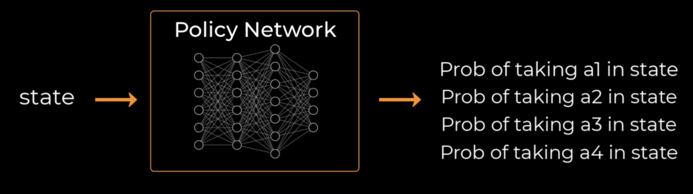

# 🚀 Proximal Policy Optimization (PPO)

- PPO is an **online**, **actor-critic** reinforcement learning algorithm.
- It builds on top of **vanilla policy gradient** → **TRPO** → and finally lands on a simpler, stable, and scalable variant called **PPO**.

______________________________________________________________________

## 🎯 Starting Point: Vanilla Policy Gradient

- **Policy network**: takes input state `s` and outputs a **distribution over actions**.

  - Discrete space → action probs
  - Continuous space → mean & std for Gaussian

- **Value network**: takes state `s` and outputs **value estimate** $V(s)$.
  → *Not* Q(s, a)



- After rollout (sampling actions from current policy), we compute:

$$
\\mathcal{L}\_{\\text{PG}} = -\\log(\\pi(a|s)) \\cdot A(s, a)
$$

> PG stands for **policy gradient**.

Where:

- $A(s, a) = R - V(s)$ is the **advantage**
- We want to increase likelihood of good actions (positive advantage)

> ℹ️ Minus sign is used because we minimize loss (PyTorch-style)

______________________________________________________________________

## ⚠️ Problem with Vanilla PG

If you collect a batch of experiences with one policy,
then perform a large update (e.g., multiple gradient steps),
→ your policy can **drift too far** from the original behavior used to collect those rollouts.
→ Leads to instability and collapse.

______________________________________________________________________

## 🧱 TRPO: Trust Region Policy Optimization

TRPO introduced a **trust region** to limit policy changes.

$$
\\max\_\\theta ; \\mathbb{E} \\left[ \\frac{\\pi\_\\theta(a|s)}{\\pi\_{\\theta\_{\\text{old}}}(a|s)} \\cdot A(s, a) \\right]
\\quad \\text{s.t.} \\quad \\mathbb{E}_s \\left\[ \\text{KL}\[\\pi_{\\theta\_{\\text{old}}} \\parallel \\pi\_\\theta\] \\right\] \\leq \\delta
$$

- KL divergence constraint ensures policy doesn’t diverge too much.
- Uses **second-order optimization**, conjugate gradients, Fisher matrix to compute the `kl-divergence` constraint.

> 🚫 Hard to implement and scale!

______________________________________________________________________

## ✅ PPO: Proximal Policy Optimization

PPO simplifies TRPO by:

1. **Replacing hard KL constraint with a clipping mechanism**
2. (Optional) Adding KL as a penalty term, or just tracking it

______________________________________________________________________

## 🔁 PPO Clipped Objective

Define:

$$
r\_\\theta = \\frac{\\pi\_\\theta(a|s)}{\\pi\_{\\theta\_{\\text{old}}}(a|s)}
$$

Clipped loss:

$$
\\mathcal{L}_{\\text{clip}} = \\mathbb{E} \\left\[ \\min \\left( r_\\theta A, ; \\text{clip}(r\_\\theta, 1 - \\epsilon, 1 + \\epsilon) A \\right) \\right\]
$$

- Clipping prevents large updates by flattening the objective if the new policy moves too far from old one.
- Keeps learning stable without needing 2nd-order methods.

______________________________________________________________________

## 🧠 Full PPO Loss

$$
\\mathcal{L}_{\\text{PPO}} = -\\mathcal{L}_{\\text{clip}} + c_v \\cdot \\text{ValueLoss} - c_e \\cdot \\text{Entropy}
$$

Where:

- `clip_loss`: clipped surrogate objective (stabilizes policy updates)

- `value_loss`:

  $$
  (V(s) - R)^2
  $$

  Critic is trained to fit actual return.

* `entropy_bonus`: encourages exploration

  $$
  -\\sum \\pi(a|s) \\log \\pi(a|s)
  $$

* Coefficients $c_v$, $c_e$: hyperparameters

______________________________________________________________________

## 🔀 PPO Variants w.r.t KL-Divergence

- **PPO-clip** (common):
  Only uses clipped objective. Monitors KL, but **doesn’t penalize it explicitly**.

- **PPO-penalty**:
  Adds KL divergence into the loss:

$$
\\mathcal{L} = \\mathcal{L}_{\\text{clip}} - \\beta \\cdot \\text{KL}(\\pi_{\\text{old}}, \\pi\_{\\theta})
$$

Adaptively adjusts $\\beta$ if KL becomes too large or too small.

- **Early stopping**:
  Some PPO setups just **stop updates** early if KL gets too big.

______________________________________________________________________

## 🔍 Advantage Estimation

PPO often uses **GAE (Generalized Advantage Estimation)**:

$$
A(s, a) = \\sum\_{l=0}^{T-t} (\\gamma \\lambda)^l \\cdot \\delta\_{t+l}
\\quad \\text{where} \\quad \\delta_t = r_t + \\gamma V(s\_{t+1}) - V(s_t)
$$

- Balances bias–variance tradeoff with $\\lambda \\in [0, 1]$

______________________________________________________________________

## 🧪 Continuous Action Space

- Actor network outputs **mean and log_std** for each action dim

- Use Normal distribution to sample action:

  ```python
  dist = torch.distributions.Normal(mean, std)
  action = dist.sample()
  log_prob = dist.log_prob(action).sum(dim=-1)
  entropy = dist.entropy().sum(dim=-1)
  ```

______________________________________________________________________

## ✅ Recap Summary

| Component      | PPO Behavior                               |
| -------------- | ------------------------------------------ |
| Algorithm type | Online, Actor-Critic                       |
| Policy loss    | Clipped surrogate objective                |
| Value loss     | MSE between predicted V(s) and return      |
| Entropy bonus  | Encourages exploration                     |
| KL divergence  | Optional (monitor / penalty / clip only)   |
| Exploration    | Via entropy; no ε-greedy                   |
| Stability      | Via clipping (instead of hard constraints) |

______________________________________________________________________

## Code

### Helper code

```python

def layer_init(
    layer: torch.nn.Module,
    std: float = math.sqrt(2),
    bias_const: float = 0.0,
    ortho_init: bool = True,
):
    if ortho_init:
        torch.nn.init.orthogonal_(layer.weight, std)
        torch.nn.init.constant_(layer.bias, bias_const)
    return layer


def linear_annealing(optimizer: torch.optim.Optimizer, update: int, num_updates: int, initial_lr: float):
    frac = 1.0 - (update - 1.0) / num_updates
    lrnow = frac * initial_lr
    for pg in optimizer.param_groups:
        pg["lr"] = lrnow
```

### PPO loss function

```python
import torch
import torch.nn.functional as F
from torch import Tensor


def policy_loss(advantages: torch.Tensor, ratio: torch.Tensor, clip_coef: float) -> torch.Tensor:
    pg_loss1 = -advantages * ratio
    pg_loss2 = -advantages * torch.clamp(ratio, 1 - clip_coef, 1 + clip_coef)
    return torch.max(pg_loss1, pg_loss2).mean()


def value_loss(
    new_values: Tensor,
    old_values: Tensor,
    returns: Tensor,
    clip_coef: float,
    clip_vloss: bool,
    vf_coef: float,
) -> Tensor:
    new_values = new_values.view(-1)
    if not clip_vloss:
        values_pred = new_values
    else:
        values_pred = old_values + torch.clamp(new_values - old_values, -clip_coef, clip_coef)
    return vf_coef * F.mse_loss(values_pred, returns)


def entropy_loss(entropy: Tensor, ent_coef: float) -> Tensor:
    return -entropy.mean() * ent_coef
```

### PPO training loop

```python
import math

import gymnasium as gym
import torch
import torch.nn.functional as F
from torch import Tensor
from torch.distributions import Categorical
from torchmetrics import MeanMetric

from lightning.pytorch import LightningModule
from rl.loss import entropy_loss, policy_loss, value_loss
from rl.utils import layer_init


class PPOAgent(torch.nn.Module):
    def __init__(self, envs: gym.vector.SyncVectorEnv, act_fun: str = "relu", ortho_init: bool = False) -> None:
        super().__init__()
        if act_fun.lower() == "relu":
            act_fun = torch.nn.ReLU()
        elif act_fun.lower() == "tanh":
            act_fun = torch.nn.Tanh()
        else:
            raise ValueError("Unrecognized activation function: `act_fun` must be either `relu` or `tanh`")
        self.critic = torch.nn.Sequential(
            layer_init(
                torch.nn.Linear(math.prod(envs.single_observation_space.shape), 64),
                ortho_init=ortho_init,
            ),
            act_fun,
            layer_init(torch.nn.Linear(64, 64), ortho_init=ortho_init),
            act_fun,
            layer_init(torch.nn.Linear(64, 1), std=1.0, ortho_init=ortho_init),
        )
        self.actor = torch.nn.Sequential(
            layer_init(
                torch.nn.Linear(math.prod(envs.single_observation_space.shape), 64),
                ortho_init=ortho_init,
            ),
            act_fun,
            layer_init(torch.nn.Linear(64, 64), ortho_init=ortho_init),
            act_fun,
            layer_init(torch.nn.Linear(64, envs.single_action_space.n), std=0.01, ortho_init=ortho_init),
        )

    def get_action(self, x: Tensor, action: Tensor = None) -> tuple[Tensor, Tensor, Tensor]:
        logits = self.actor(x)
        distribution = Categorical(logits=logits)
        if action is None:
            action = distribution.sample()
        return action, distribution.log_prob(action), distribution.entropy()

    def get_greedy_action(self, x: Tensor) -> Tensor:
        logits = self.actor(x)
        probs = F.softmax(logits, dim=-1)
        return torch.argmax(probs, dim=-1)

    def get_value(self, x: Tensor) -> Tensor:
        return self.critic(x)

    def get_action_and_value(self, x: Tensor, action: Tensor = None) -> tuple[Tensor, Tensor, Tensor, Tensor]:
        action, log_prob, entropy = self.get_action(x, action)
        value = self.get_value(x)
        return action, log_prob, entropy, value

    def forward(self, x: Tensor, action: Tensor = None) -> tuple[Tensor, Tensor, Tensor, Tensor]:
        return self.get_action_and_value(x, action)

    @torch.no_grad()
    def estimate_returns_and_advantages(
        self,
        rewards: Tensor,
        values: Tensor,
        dones: Tensor,
        next_obs: Tensor,
        next_done: Tensor,
        num_steps: int,
        gamma: float,
        gae_lambda: float,
    ) -> tuple[Tensor, Tensor]:
        next_value = self.get_value(next_obs).reshape(1, -1)
        advantages = torch.zeros_like(rewards)
        lastgaelam = 0
        for t in reversed(range(num_steps)):
            if t == num_steps - 1:
                nextnonterminal = torch.logical_not(next_done)
                nextvalues = next_value
            else:
                nextnonterminal = torch.logical_not(dones[t + 1])
                nextvalues = values[t + 1]
            delta = rewards[t] + gamma * nextvalues * nextnonterminal - values[t]
            advantages[t] = lastgaelam = delta + gamma * gae_lambda * nextnonterminal * lastgaelam
        returns = advantages + values
        return returns, advantages


class PPOLightningAgent(LightningModule):
    def __init__(
        self,
        envs: gym.vector.SyncVectorEnv,
        act_fun: str = "relu",
        ortho_init: bool = False,
        vf_coef: float = 1.0,
        ent_coef: float = 0.0,
        clip_coef: float = 0.2,
        clip_vloss: bool = False,
        normalize_advantages: bool = False,
        **torchmetrics_kwargs,
    ):
        super().__init__()
        if act_fun.lower() == "relu":
            act_fun = torch.nn.ReLU()
        elif act_fun.lower() == "tanh":
            act_fun = torch.nn.Tanh()
        else:
            raise ValueError("Unrecognized activation function: `act_fun` must be either `relu` or `tanh`")
        self.vf_coef = vf_coef
        self.ent_coef = ent_coef
        self.clip_coef = clip_coef
        self.clip_vloss = clip_vloss
        self.normalize_advantages = normalize_advantages
        self.critic = torch.nn.Sequential(
            layer_init(
                torch.nn.Linear(math.prod(envs.single_observation_space.shape), 64),
                ortho_init=ortho_init,
            ),
            act_fun,
            layer_init(torch.nn.Linear(64, 64), ortho_init=ortho_init),
            act_fun,
            layer_init(torch.nn.Linear(64, 1), std=1.0, ortho_init=ortho_init),
        )
        self.actor = torch.nn.Sequential(
            layer_init(
                torch.nn.Linear(math.prod(envs.single_observation_space.shape), 64),
                ortho_init=ortho_init,
            ),
            act_fun,
            layer_init(torch.nn.Linear(64, 64), ortho_init=ortho_init),
            act_fun,
            layer_init(torch.nn.Linear(64, envs.single_action_space.n), std=0.01, ortho_init=ortho_init),
        )
        self.avg_pg_loss = MeanMetric(**torchmetrics_kwargs)
        self.avg_value_loss = MeanMetric(**torchmetrics_kwargs)
        self.avg_ent_loss = MeanMetric(**torchmetrics_kwargs)

    def get_action(self, x: Tensor, action: Tensor = None) -> tuple[Tensor, Tensor, Tensor]:
        logits = self.actor(x)
        distribution = Categorical(logits=logits)
        if action is None:
            action = distribution.sample()
        return action, distribution.log_prob(action), distribution.entropy()

    def get_greedy_action(self, x: Tensor) -> Tensor:
        logits = self.actor(x)
        probs = F.softmax(logits, dim=-1)
        return torch.argmax(probs, dim=-1)

    def get_value(self, x: Tensor) -> Tensor:
        return self.critic(x)

    def get_action_and_value(self, x: Tensor, action: Tensor = None) -> tuple[Tensor, Tensor, Tensor, Tensor]:
        action, log_prob, entropy = self.get_action(x, action)
        value = self.get_value(x)
        return action, log_prob, entropy, value

    def forward(self, x: Tensor, action: Tensor = None) -> tuple[Tensor, Tensor, Tensor, Tensor]:
        return self.get_action_and_value(x, action)

    @torch.no_grad()
    def estimate_returns_and_advantages(
        self,
        rewards: Tensor,
        values: Tensor,
        dones: Tensor,
        next_obs: Tensor,
        next_done: Tensor,
        num_steps: int,
        gamma: float,
        gae_lambda: float,
    ) -> tuple[Tensor, Tensor]:
        next_value = self.get_value(next_obs).reshape(1, -1)
        advantages = torch.zeros_like(rewards)
        lastgaelam = 0
        for t in reversed(range(num_steps)):
            if t == num_steps - 1:
                nextnonterminal = torch.logical_not(next_done)
                nextvalues = next_value
            else:
                nextnonterminal = torch.logical_not(dones[t + 1])
                nextvalues = values[t + 1]
            delta = rewards[t] + gamma * nextvalues * nextnonterminal - values[t]
            advantages[t] = lastgaelam = delta + gamma * gae_lambda * nextnonterminal * lastgaelam
        returns = advantages + values
        return returns, advantages

    def training_step(self, batch: dict[str, Tensor]):
        # Get actions and values given the current observations
        _, newlogprob, entropy, newvalue = self(batch["obs"], batch["actions"].long())
        logratio = newlogprob - batch["logprobs"]
        ratio = logratio.exp()

        # Policy loss
        advantages = batch["advantages"]
        if self.normalize_advantages:
            advantages = (advantages - advantages.mean()) / (advantages.std() + 1e-8)

        pg_loss = policy_loss(batch["advantages"], ratio, self.clip_coef)

        # Value loss
        v_loss = value_loss(
            newvalue,
            batch["values"],
            batch["returns"],
            self.clip_coef,
            self.clip_vloss,
            self.vf_coef,
        )

        # Entropy loss
        ent_loss = entropy_loss(entropy, self.ent_coef)

        # Update metrics
        self.avg_pg_loss(pg_loss)
        self.avg_value_loss(v_loss)
        self.avg_ent_loss(ent_loss)

        # Overall loss
        return pg_loss + ent_loss + v_loss

    def on_train_epoch_end(self, global_step: int) -> None:
        # Log metrics and reset their internal state
        self.logger.log_metrics(
            {
                "Loss/policy_loss": self.avg_pg_loss.compute(),
                "Loss/value_loss": self.avg_value_loss.compute(),
                "Loss/entropy_loss": self.avg_ent_loss.compute(),
            },
            global_step,
        )
        self.reset_metrics()

    def reset_metrics(self):
        self.avg_pg_loss.reset()
        self.avg_value_loss.reset()
        self.avg_ent_loss.reset()

    def configure_optimizers(self, lr: float):
        return torch.optim.Adam(self.parameters(), lr=lr, eps=1e-4)
```

- Above code has been taken from `lightning-ai/pytorch-lightning/examples` repository.

______________________________________________________________________

## 📖 Summary

!!! note "overview"
\- Proximal Policy Optimization (PPO) is a reinforcement learning algorithm that trains an agent to learn good behavior through interaction with its environment.
\- It uses two neural networks: one to decide actions (the policy network) and another to estimate how good a state is (the value network).
\- After collecting a batch of experiences by running the current policy, PPO computes how much better or worse the chosen actions were compared to what was expected (advantage).
\- It then updates the policy in a way that improves it, but not too drastically — ensuring stability by limiting how much the new policy can diverge from the old one.
\- To encourage exploration, it adds an entropy bonus, and it adjusts the learning rate gradually over time (linear annealing).
\- PPO balances simplicity, performance, and stability, making it one of the most widely used algorithms in modern reinforcement learning.
